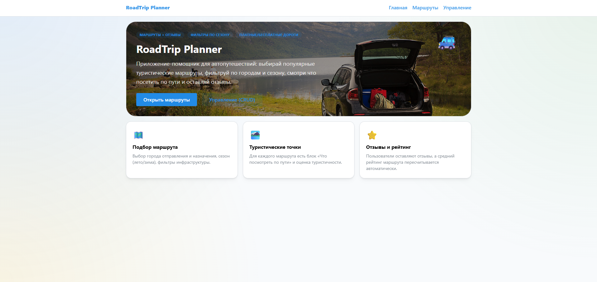
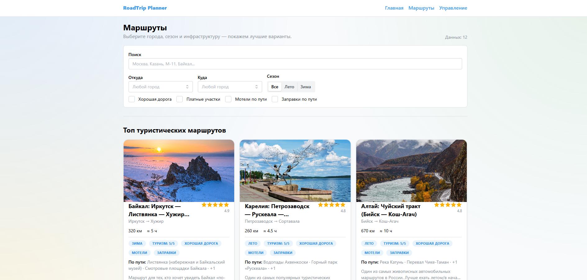
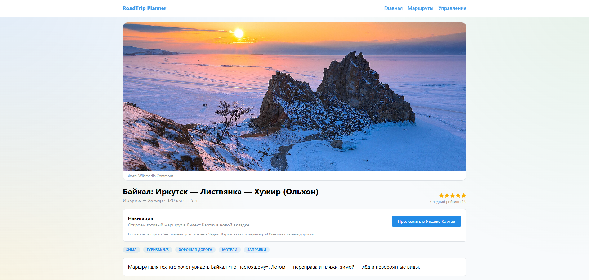
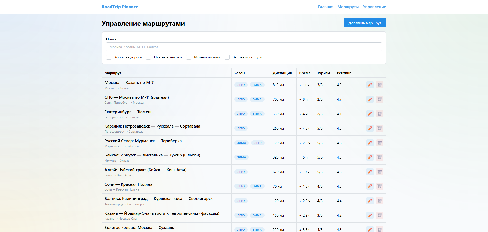

# 🚗 RoadTrip Planner

**Приложение для планирования автопутешествий** — каталог маршрутов с фильтрами, туристическими рекомендациями, отзывами и управлением маршрутами (CRUD).


---

## 📸 Скриншоты

### Главная страница (лендинг)


### Каталог маршрутов с фильтрами


### Карточка маршрута: детали и «Что посмотреть по пути»


### Управление маршрутами (CRUD)


> 💡 Скриншоты можно добавить в папку `docs/screenshots/`. Имена файлов: `01-landing.png`, `02-routes-catalog.png`, `03-route-details.png`, `04-manage-routes.png`.

---

## ✨ Возможности

| Функция | Описание |
|--------|----------|
| **Каталог маршрутов** | Список маршрутов с фильтрами по городу отправления/назначения, сезону (лето/зима), платным участкам, качеству дороги, наличию мотелей и заправок |
| **Туристические маршруты** | Оценка «туристичности» и блок **«Что посмотреть по пути»** для каждого маршрута |
| **Страница маршрута** | Подробная карточка с описанием, точками интереса, отзывами и рейтингом |
| **Управление маршрутами** | Создание, редактирование и удаление маршрутов (CRUD) |
| **Асинхронные данные** | Загрузка через **Axios**, кэширование и мутации через **TanStack Query** |
| **Формы и валидация** | **react-hook-form** + клиентская валидация схем **Zod** |
| **UI** | Компоненты **Mantine UI** и уведомления |

---

## 🛠 Стек технологий

- **Frontend:** React 19, TypeScript, Vite 7
- **Маршрутизация:** React Router 7
- **UI:** Mantine UI 8 + Notifications
- **Данные:** TanStack Query (React Query) 5, Axios
- **Формы:** react-hook-form + Zod
- **Бэкенд (разработка):** json-server (мок API на `server/db.json`)

---

## 📁 Структура проекта

```
roadtrip-planner/
├── src/
│   ├── app/              # Провайдеры, роутер
│   ├── features/
│   │   ├── routes/       # API, хуки, компоненты маршрутов
│   │   └── reviews/      # API и хуки отзывов
│   ├── pages/            # Страницы приложения
│   │   ├── LandingPage.tsx
│   │   ├── RoutesPage.tsx
│   │   ├── RouteDetailsPage.tsx
│   │   └── ManageRoutesPage.tsx
│   └── ...
├── server/
│   └── db.json           # Моковые данные (маршруты, отзывы)
├── docs/
│   └── screenshots/      # Скриншоты для README
└── package.json
```

---

## 🚀 Как запустить

**Требования:** Node.js 18+

### 1. Клонирование и установка зависимостей

```bash
git clone https://github.com/YOUR_USERNAME/roadtrip-planner.git
cd roadtrip-planner
npm install
```

### 2. Запуск (рекомендуемый способ — всё одной командой)

```bash
npm run dev:all
```

Будет запущены:
- **json-server** на `http://localhost:3001` (мок API)
- **Vite** (фронтенд) — откройте в браузере адрес из вывода (обычно `http://localhost:5173`)

### 3. Запуск по отдельности (два терминала)

**Терминал 1 — бэкенд:**
```bash
npm run server
```

**Терминал 2 — фронтенд:**
```bash
npm run dev
```

### Доступные скрипты

| Команда | Описание |
|---------|----------|
| `npm run dev` | Запуск только фронтенда (Vite) |
| `npm run server` | Запуск только json-server на порту 3001 |
| `npm run dev:all` | Одновременный запуск сервера и фронтенда |
| `npm run build` | Сборка для production (`tsc -b && vite build`) |
| `npm run preview` | Локальный просмотр собранной версии |
| `npm run lint` | Проверка кода ESLint |

---

## 📄 Страницы приложения

| Путь | Описание |
|------|----------|
| `/` | Лендинг — главная страница |
| `/routes` | Каталог маршрутов с фильтрами и блок «Топ туристических маршрутов» |
| `/routes/:id` | Карточка маршрута: описание, точки по пути, отзывы и рейтинг |
| `/manage` | Управление маршрутами: создание, редактирование, удаление |

---

## 📜 Лицензия

Учебный проект

---


